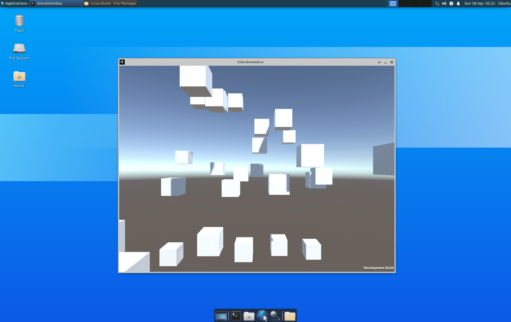

# Simulonimbus

Simulonimbus is a basic Unity performance benchmarking tool. It contains a scene that spawns cube GameObjects at a certain rate then logs the minimum, maximum and average FPS counts after a specified warmup duration.

In order to run this in a x86 linux box, upload the contents of the `Simulonimbus-Build` directory and run it. The window will close itself once the test is finished, and the results will be logged in a file with a pattern `Simulonimbus-Build-Data/PerfTestResults/PerformanceTest_*.json`.

If running from command line, you can use the flag `-testlength` to override the default value of 10 seconds for the test duration.

## Simulonimbus Running in an EC2 Instance

